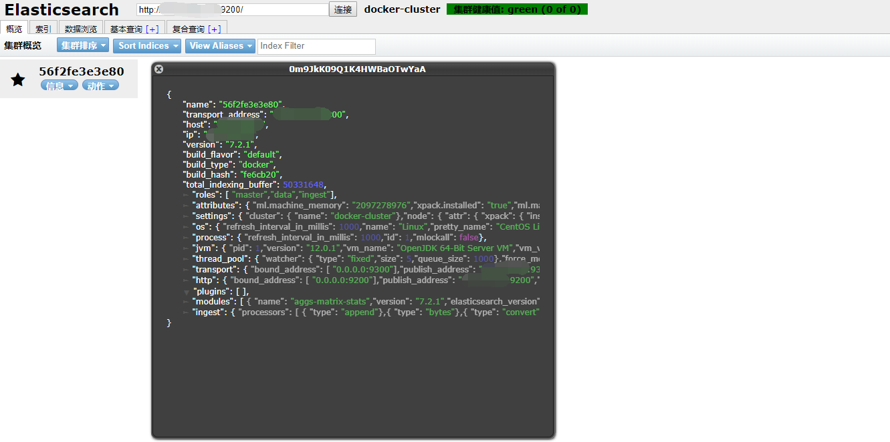
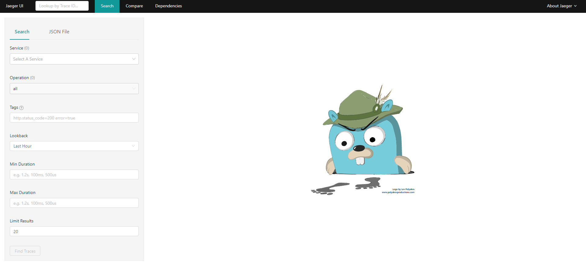
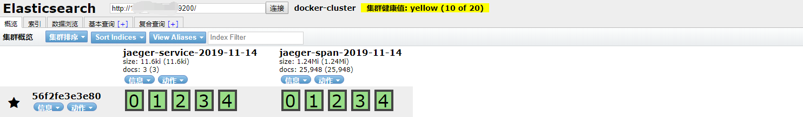
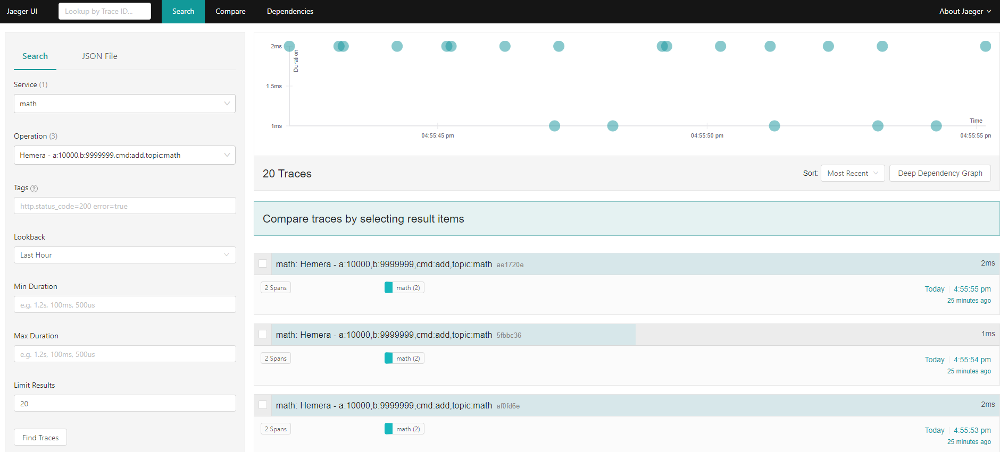
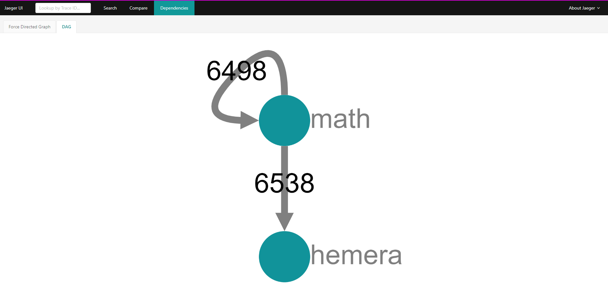

# hemera-monitor
hemera服务监控

### 需要安装jaeger服务
通过 `Docker` 容器安装，所以需要先安装 `Docker`,这里以 `Ubuntu 16.4` 系统为安装实例

####  Docker安装

- 卸载旧版本Docker，全新安装时，无需执行该步骤
  ```sh
  sudo apt-get remove docker docker-engine docker.io
  ```

- 更新系统软件
  ```sh
  sudo apt-get update
  ```

- 安装依赖包
  ```sh
  sudo apt-get install \
  apt-transport-https \
  ca-certificates \
  curl \
  software-properties-common
  ```

- 添加官方密钥，执行该命令时，如遇到长时间没有响应说明网络连接不到Docker网站，需要使用代-理进行。
  ```sh
  curl -fsSL https://download.docker.com/linux/ubuntu/gpg | sudo apt-key add - # 显示OK,表示添加成功
  ```

- 添加仓库
   ```sh
   sudo add-apt-repository \
   "deb [arch=amd64] https://download.docker.com/linux/ubuntu \
   $(lsb_release -cs) \
   stable"
   ```

- 再次更新软件，经实践，这一步不能够省略，我们需要再次把软件更新到最新，否则下一步有可能会报错。
   ```sh
   sudo apt-get update
   ```

- 安装Docker，如果想指定安装某一版本，可使用 `sudo apt-get install docker-ce=<VERSION>`  命令，把<VERSION>替换为具体版本即可，以下命令没有指定版本，默认就会安装最新版
  ```sh
  sudo apt-get install docker-ce
  ```

- 查看Docker版本
  ```sh
  docker -v #显示“Docker version 17.09.0-ce, build afdb6d4”字样，表示安装成功
  ```

- 修改Docker 镜像路径，首先停止docker服务
  ```sh
  sudo service docker stop
  ```

- 进入 docker.service.d中，docker.service.d 如果没有请自行创建；
  ```sh
  cd etc/systemd/system/docker.service.d
  ```

- 修改 docker-overlay.conf 文件，如果没有请自行创建；
  ```sh
  sudo vim docker-overlay.conf
  ```

- 在文件中添加内容
  ```sh
  [Service]
  ExecStart=
  ExecStart=/usr/bin/dockerd --graph="你的路径" --storage-driver=overlay
  ```

- 重启docker
  ```sh
  systemctl daemon-reload
  sudo service docker start
  ```

- 查看docker 信息，确认是否已经修改成功
  ```sh
  sudo docker info
  #Docker Root Dir:你的镜像路径
  ```

- 由于默认镜像源是国外的，下载容器可能会很慢，所以这里需要更换镜像源，国内亲测可用的几个镜像源：
>>> Docker 官方中国区：https://registry.docker-cn.com

>>> 网易：http://hub-mirror.c.163.com

>>> 中国科技大学：https://docker.mirrors.ustc.edu.cn

>>> 阿里云：https://y0qd3iq.mirror.aliyuncs.com

- 增加Docker的镜像源配置文件 /etc/docker/daemon.json，如果没有配置过镜像该文件默认是不存的

  ```sh
  cd /etc/docker/
  vim daemon.json 
  # 在其中增加如下内容：
  {
    "registry-mirrors": ["https://y0qd3iq.mirror.aliyuncs.com"]
  }
  ```

- 然后重启Docker服务：
  ```sh
  service docker restart
  ```

- 然后通过以下命令查看配置是否生效
  ```sh
  docker info|grep Mirrors -A 1
  # 可以看到如下的输出：
  Registry Mirrors:
  https://y0qd3iq.mirror.aliyuncs.com/
  # 就表示镜像配置成功，然后再执行docker pull操作，就会很快了。
  ```

####  Docker-compose安装

- 下载 `Docker-compose`
  ```sh
  sudo curl -L https://github.com/docker/compose/releases/download/1.17.0/docker-compose-`uname -s`-`uname -m` -o /usr/local/bin/docker-compose
  ```

- 授权
  ```sh
  sudo chmod +x /usr/local/bin/docker-compose
  ```

- 查看版本信息
  ```sh
  docker-compose --version #显示出版本信息，即安装成功
  ```

#### Docker-machine安装

> 说明：`Docker-machine` 的使用是要基于` virtualBox` 的。如果没有安装安装过，请先安装 `virtualBox`

- 安装virtualBox
 
 > [登录virtualBox官网](https://www.virtualbox.org/wiki/Linux_Downloads) 找到 `Ubuntu 16.04 (Xenial)  i386 |  AMD64` 字样，点击 `AMD64` 进行下载，下载后，执行以下命令进行安装
  ```sh
  sudo dpkg -i virtualbox-5.2_5.2.0-118431_Ubuntu_xenial_amd64.deb
  ```

- 下载并安装Docker-machine
  ```sh
  curl -L https://github.com/docker/machine/releases/download/v0.13.0/docker-machine-`uname -s`-`uname -m` >/tmp/docker-machine &&
  chmod +x /tmp/docker-machine &&
  sudo cp /tmp/docker-machine /usr/local/bin/docker-machine
  ```

- 查看版本信息
  ```sh
  docker-machine version
  ```

#### 利用 `ElasticSearch` 作为存储引擎部署 `jaeger`

- 拉取镜像
  ```sh
  docker pull docker.elastic.co/elasticsearch/elasticsearch:7.2.1
  ```

- 运行容器 `ElasticSearch` 的默认端口是 `9200`，我们把宿主环境 `9200` 端口映射到 `Docker` 容器中的 `9200` 端口，就可以访问到 `Docker` 容器中的 `ElasticSearch` 服务了，同时我们把这个容器命名为 `es`
  ```sh
  docker run -d --name es -p 9200:9200 -p 9300:9300 -e "discovery.type=single-node" docker.elastic.co/elasticsearch/elasticsearch:7.2.1
  ```

- 创建容器时添加参数 `--restart=always` 后，当 `Docker` 重启时，容器自动启动，创建完容器也可以设置，使用方法
  ```sh
  docker container update --restart=always 容器名字
  ```

- 配置跨域，进入容器，由于要进行配置，因此需要进入容器当中修改相应的配置信息
  ```sh
  docker exec -it 上面创建容器的名字 /bin/bash
  ```
- 进行配置
```sh
  # 显示文件
  ls
  结果如下：
  LICENSE.txt  README.textile  config  lib   modules
  NOTICE.txt   bin             data    logs  plugins

  # 进入配置文件夹
  cd config

  # 显示文件
  ls
  结果如下：
  elasticsearch.keystore  ingest-geoip  log4j2.properties  roles.yml  users_roles
  elasticsearch.yml       jvm.options   role_mapping.yml   users

  # 修改配置文件
  vi elasticsearch.yml

  # 加入跨域配置
  http.cors.enabled: true
  http.cors.allow-origin: "*"
  path.data: /path/to/data1,/path/to/data2 #存储路径，可以是多个
  path.logs: /path/to/logs
  path.plugins: /path/to/plugins
  ```

- 重启容器，由于修改了配置，因此需要重启ElasticSearch容器
  ```sh
  docker restart es
  ```

#### Docker 部署 ElasticSearch-Head

- 为什么要安装ElasticSearch-Head呢，原因是需要有一个管理界面进行查看ElasticSearch相关信息，拉取镜像
  ```sh
  docker pull mobz/elasticsearch-head:5
  ```

- 运行容器
  ```sh
  docker run -d --name es_admin -p 9100:9100 mobz/elasticsearch-head:5
  ```

- 访问管理页面，地址栏输入你的IP://9100就可以看到管理页面


**ElasticSearch更详细的配置请查看官网或后期更新配置参数说明**

#### 配置 `jaeger` 的路由部分 `jaeger-collector`

- 拉取镜像
  ```sh
  docker pull jaegertracing/jaeger-collector
  ```

- 若你安装的collector和elasticsearch是在同一台机器上，使用docker容易的--link命令就可以将collector和elasticsearch关联上，安装命令如下
  ```sh
  docker run -d --name jaeger-collector --restart=always --link es:es -e SPAN_STORAGE_TYPE=elasticsearch -e ES_SERVER_URLS=http://es:9200 -e ES_USERNAME=elastic -p 14267:14267 -p 14268:14268 -p 9411:9411 jaegertracing/jaeger-collector
  ```
  **注意:**

  --link es:es，代表docker容易关联，该名字必须和你安装elasticsearch —name的名字相同
  
  --SPAN_STORAGE_TYPE=elasticsearch 代表安装jaeger选择elasticsearch作为存储

  --e ES_SERVER_URLS=http://es:9200次条目代表你选择容器安装的elasticsearch的9200端口

  --e ES_USERNAME elasticsearch的用户名:默认elastic，下同

  --e ES_PASSWORD elasticsearch的密码

  --e 其实就是代表的环境变量，其他变量你可以使用以下语句查看：
  ```sh
  docker run -e SPAN_STORAGE_TYPE=elasticsearch jaegertracing/jaeger-collector /go/bin/collector-linux --help
  ```

- 当然，一般生产环境你肯定不会将collector和elasticsearch安装到同一台机器，至少你可能会安装多个collector，所以，如何跨机器的用collector连接此elasticsearch呢？

  你可以用用以下命令：
  ```sh
  docker run -d --name jaeger-collector  --restart=always -e SPAN_STORAGE_TYPE=elasticsearch -e ES_SERVER_URLS=http://你的es ip:9200 -e ES_USERNAME=elastic -p 14267:14267 -p 14268:14268 -p 9411:9411 jaegertracing/jaeger-collector
  ```
  区别在于，你无需使用—link来进行容器互连，只需ES_SERVER_URLS填写对应的ip和port即可

  #### 配置 `jaeger` 的查询部分 `jaeger-query`

- 拉取镜像
  ```sh
  docker pull jaegertracing/jaeger-query
  ```
  
- 同collector一样，若你安装的collector和elasticsearch是在同一台机器上，使用docker容易的--link命令就可以将query和elasticsearch关联上，安装命令如下
  ```sh
  docker run -d --name jaeger-query --restart=always --link es:es -e SPAN_STORAGE_TYPE=elasticsearch -e ES_SERVER_URLS=http://es:9200 -e ES_USERNAME=elastic -e ES_PASSWORD=你的密码 -p 16686:16686/tcp jaegertracing/jaeger-query
  ```
  其他对应的操作，你参考collector即可，到了这一步，如果你能将collector部署好，那么部署query也是一样的

  **注意：**

  ES_USERNAME、ES_PASSWORD这两个环境变量，当你的elasticsearch未设置账号密码时，你可以不填，也可以填上默认值，elasticsearch的默认ES_USERNAME=elastic，ES_PASSWORD=changeme

  部署完成query之后，根据你暴露的端口号（-p 16686:16686/tcp），浏览器输入以下地址(将localhost换成你部署query的地址)

  http://localhost:16686
  
  访问管理页面，地址栏输入你的IP://9100就可以看到管理页面

  

  你就会看到开篇的UI界面了,当然数据肯定是空空如也

 #### 配置 `jaeger` 的客户端数据转发部分 `jaeger-agent`

> 根据uber jaeger官网的架构，agent一般是和jaeger-client部署在一起，agent作为一个基础架构，每一台应用（接入jaeger-client的应用）所在的机器都需要部署一个agent，根据数据采集原理，jaeger-client采集到数据之后，是通过UDP端口发送到agent的，jaeger-client和agent部署在一起的好处是UDP传输数据都在应用所在的机器，可避免UDP的跨网络传输，多一层安全保障。当然，架构可能是多变的，你的agent可能不和jaeger-client所在的应用在一台机器，这个时候，jaeger-client就必须显示的指定其连接的agent的IP及port,具体做法后文jaeger-client对应模块会讲到。前文提到，jaeger-client采集到数据之后，是通过UDP端口发送到agent的，agent接收到数据之后，使用Uber的Tchannel协议，将数据发送到collector，所以，agent是必须和collector相连的

- docker安装agent命令如下：
  ```sh
  # 拉取镜像
  docker pull jaegertracing/jaeger-agent
  # 启动镜像
  docker run   -d  --name jaeger-agent --restart=always -p 5775:5775/udp   -p 6831:6831/udp   -p 6832:6832/udp   -p 5778:5778/tcp   jaegertracing/jaeger-agent   /go/bin/agent-linux --collector.host-port=collector ip:14267
  ```

- 如果客户端jaeger-client在Windows系统上也可以直接下载exe格式的jaeger-agent，启动方式如下
  ```sh
  jaeger-agent.exe --collector.host-port=你的jaeger-collector安装地址IP加端口
  ```

- 如前文所述，你可能不止一个collector，你可能需要这样
  ```sh
  docker run -d --name jaeger-agent --restart=always -p 5775:5775/udp -p 6831:6831/udp -p 6832:6832/udp -p 5778:5778/tcp   jaegertracing/jaeger-agent /go/bin/agent-linux --collector.host-port=collector ip1:14267,collector ip2:14267,collector ip3:14267
  ```
  --collector.host-port=collector ip1:14267,collector ip2:14267,collector ip3:14267，用逗号分开，连接三个collector，这样的话，这三个collector只要一个存活，agent就可以吧数据传输完成，以避免单点故障


 #### 配置 `jaeger` 的客户端 `jaeger-clinet`

 **这里以 `jaeger-node-client` 为例**

 ```js
 const { initTracer } = require('jaeger-client')
 const config = {
  serviceName: 'math',
  sampler: {
    type: 'const',
    param: 1,
    hostPort: '127.0.0.1:5778',
    host: '127.0.0.1',
    port: 5778,
  },
  reporter: {
    logSpans: true
  }
}
const options = {
  logger: {
    info: function logInfo(msg) {
      console.log('INFO ', msg)
    },
    error: function logError(msg) {
      console.log('ERROR', msg)
    }
  }
}

const tracer = initTracer(config, options) //实例Tracer，具体参数细节查看文档，具体使用根据业务需求
const span = tracer.startSpan()
span.setTag('test', 'test')
span.finish()
```

- 现在再看 `Elasticsearch` 管理页面就会有数据显示

  

- Jaeger数据展示页面也会相应有数据

  


 #### 配置 `jaeger` 相连性服务 `jaeger dependencies`

>完成安装 `jaeger` 以后，你应该可以在 `jaeger ui` 上看到效果了，你可以采集到对应的数据，并且能够查询到调用链路。但是你会发现 `search` 按钮旁边，还有一个 `dependencies` 选项，你点开确什么也没有，此时你还需要安装 `jaeger dependencies` 了，而且他需要定时执行，因为 `jaeger dependencies` 是在执行时去捞取对应的数据，这里使用 `Docker` 容器安装

- 拉取镜像
  ```sh
  docker pull jaegertracing/spark-dependencies
  ```

- 运行容器
  ```sh
  docker run --rm --name spark-dependencies --env STORAGE=elasticsearch --env ES_NODES=http://安装elasticsearch的地址:9200 jaegertracing/spark-dependencies
  ```
  --ES_NODES为前面安装的elasticsearch地址

- 可以看到 `dependencies` 页面有数据展示

  


- 这里我采用Ubuntu Cron定时程序，配置命令
  ```sh
  5 0 * * * docker run --rm --name spark-dependencies --env STORAGE=elasticsearch --env ES_NODES=http://安装elasticsearch的地址:9200 jaegertracing/spark-dependencies
  ```
  [Cron定时程序具体使用参考](https://blog.csdn.net/qq_42881421/article/details/90814412)


## jaeger基本运行配置完成，还需后期继续完善
 